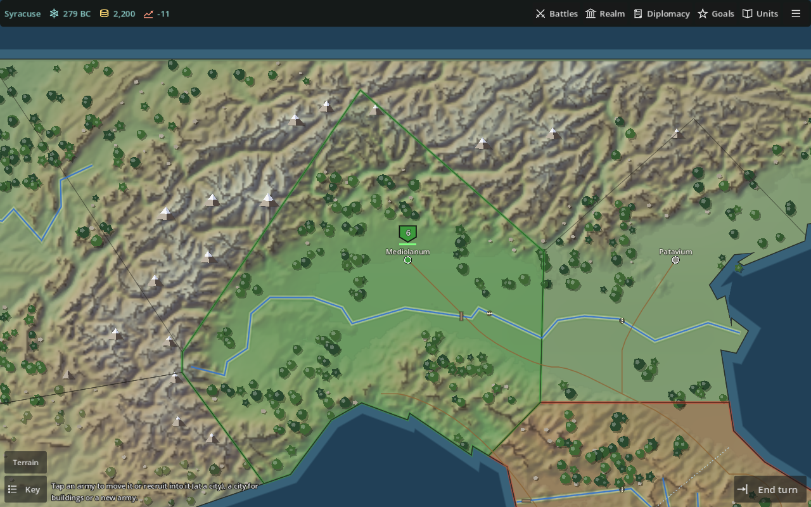
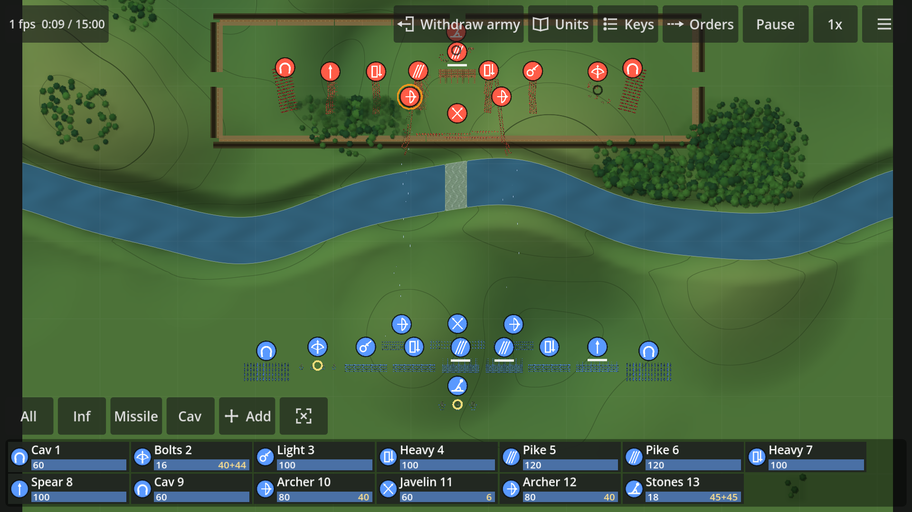
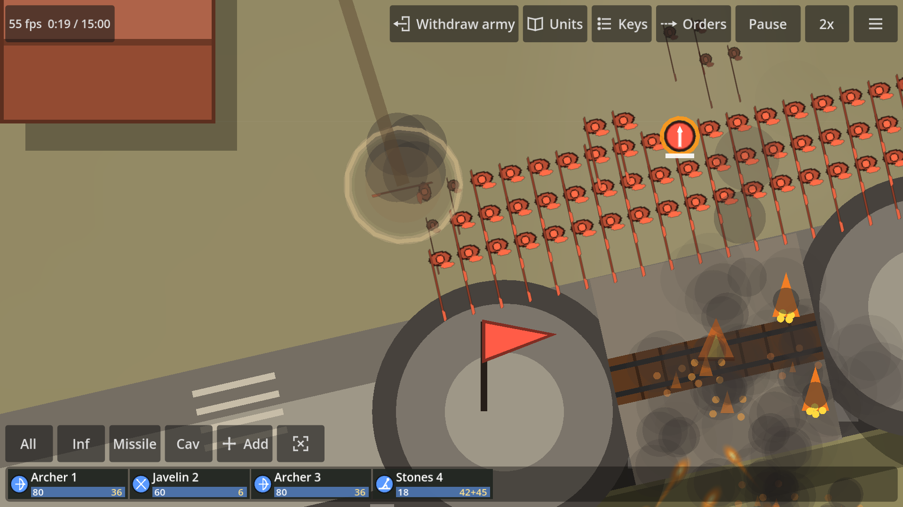
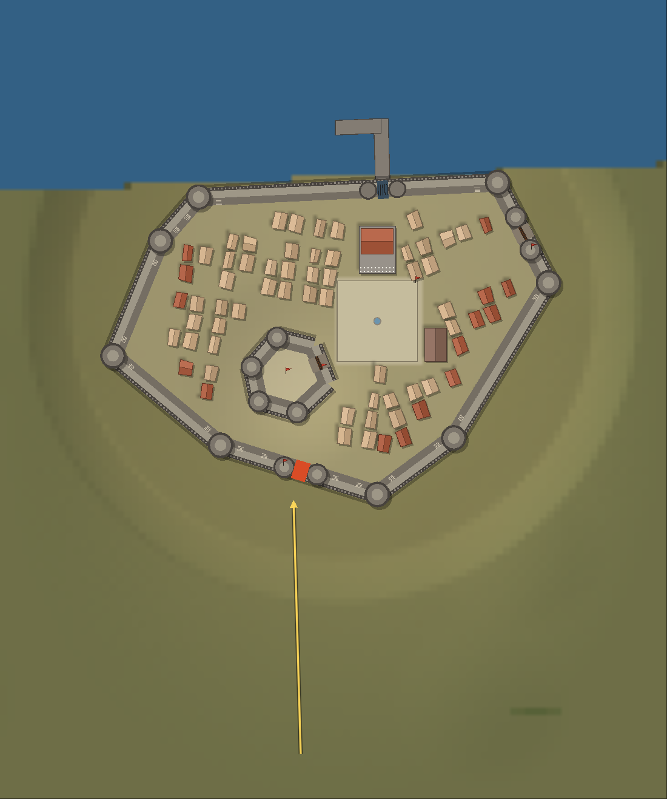
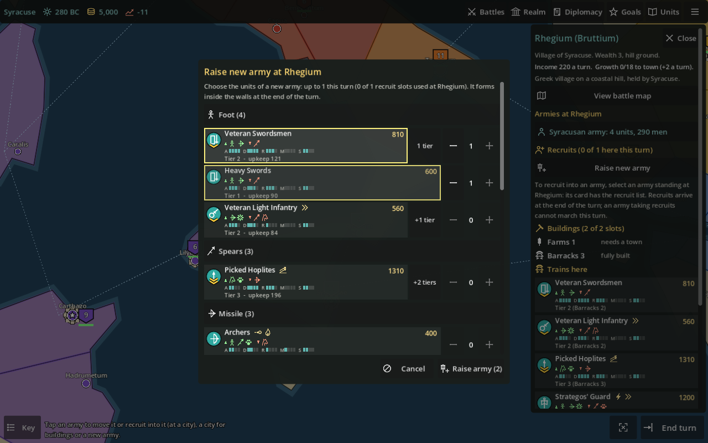
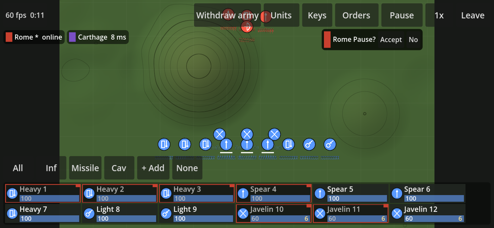

# Strategic Command

A co-op grand strategy game in the spirit of *Rome II: Total War*, built for
phones and browsers. Run an empire in the western Mediterranean of 280 BC on
your own time, then meet up for the battles.

## What it is

- **A campaign you play in 15-minute sittings.** Each of you commands a
  faction; turns are asynchronous, so you move your armies, build and
  recruit whenever you like and the turn resolves when you've both
  submitted. Pick any two factions: Rome, Carthage, Syracuse, Epirus,
  Macedon, the Greeks, the Iberians, the Gauls.
- **A real map.** The overworld is fitted to real elevation, coastlines and
  rivers: mountains cost movement, rivers block it except at the historic
  fords and bridges, Roman roads speed it up, and a battle at a crossing is
  fought on that crossing's own map, where a fortified defender holds the
  far bank from a camp at the ford.
- **Real battles, not dice rolls.** Every soldier is simulated: health,
  shield, blocks, hits, fatigue and nerve. Pikes hold, cavalry charges
  wrap round a flank, archers lead their targets, bolt and stone throwers
  need a line of fire, and units break and run when they have had enough.
  Four thousand men on a phone at 60 fps.
- **A full roster.** Heavy and light foot, spears and pikes, archers,
  javelins and slingers, shock and missile cavalry, camels that spook
  horses, elephants that break lines or run amok, war dogs loosed on
  skirmishers, and a general whose presence steadies his men. Fire arrows,
  lead bullets and explosive stones as special ammunition; forage in the
  woods or bring a wagon when the quivers run dry.
- **Sieges that feel like sieges.** Settlements grow from villages to
  walled cities in the style of their founders: Roman grids, Greek towns
  with an acropolis, Punic citadels, Celtic hill forts. Bolt and stone
  throwers on the towers, ladders, rams, siege towers and mantlets earned
  by besieging for turns, stakes and caltrops in the field, a palisaded
  camp when you fortify. Break a gate, burn it, climb the wall, take the
  plaza. Or starve them out.
- **Fight together, live.** When a battle has both your armies in it you
  can jump in at the same time: each commands their own units, you can
  gift units to each other mid-fight, and pause and speed are by vote.
  Or auto-resolve and get on with the turn.
- **An AI that plays by your rules.** Easy, Average and Skilled on the
  field and on the map, with no cheats: skill is reaction, perception and
  planning. The diplomacy screen tells you whether an AI would accept
  your offer before you send it, and a chronicle keeps the world's news
  turn by turn.

| | |
|---|---|
|  |  |
| A ford battle: the defenders fortified at the crossing | Fire arrows on the gate and a blast in the ranks |
|  |  |
| A Greek city on a coastal hill with its acropolis | Raising an army: what each unit is good and bad against |

## Co-op play

1. One of you creates a campaign and sends the other a join code.
2. Each turn: move armies across the map (roads, rivers, hills, zones of
   control, sieges by marching onto a city), build, recruit, trade, make
   and break treaties. Armies within range support each other in battle.
   Submit.
3. When a battle involves one of you, you get a ping. Fight it yourself,
   auto-resolve it, or open the lobby and fight it together in real time;
   the other player can join any fought battle and be given units.
4. Gift units, armies, cities or money to each other on the map, and pass
   units across during a live battle.

## Tech, briefly

Godot 4 (GDScript), exported to the web as a progressive web app; a
deterministic integer-only battle simulation with lockstep networking for
live co-op; a small Go server with SQLite for campaigns, turns and battle
coordination; the overworld baked from public-domain elevation (ETOPO 2022)
and Natural Earth coastlines and rivers by a tool that takes any window of
the globe, so the same engine can carry other settings. Design notes live
in [`docs/`](docs/).

Playable in any modern browser on Android, iPhone or desktop. Ask Garrett
for the link and the invite key.
