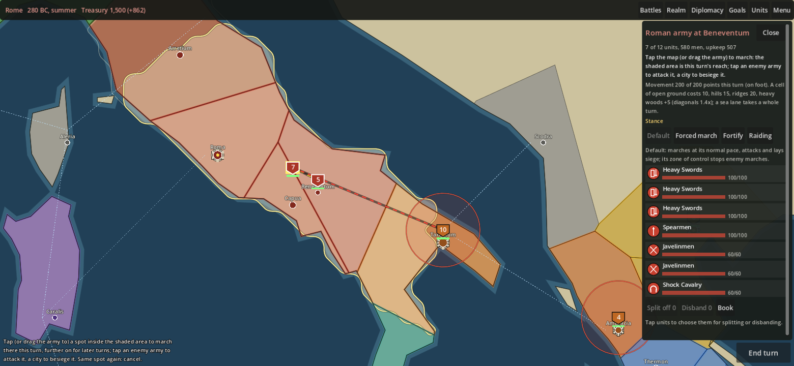
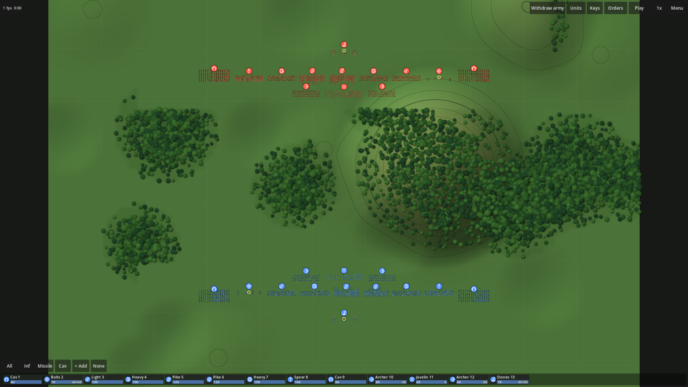
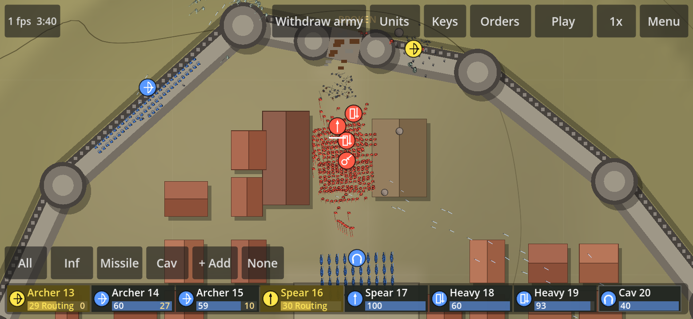
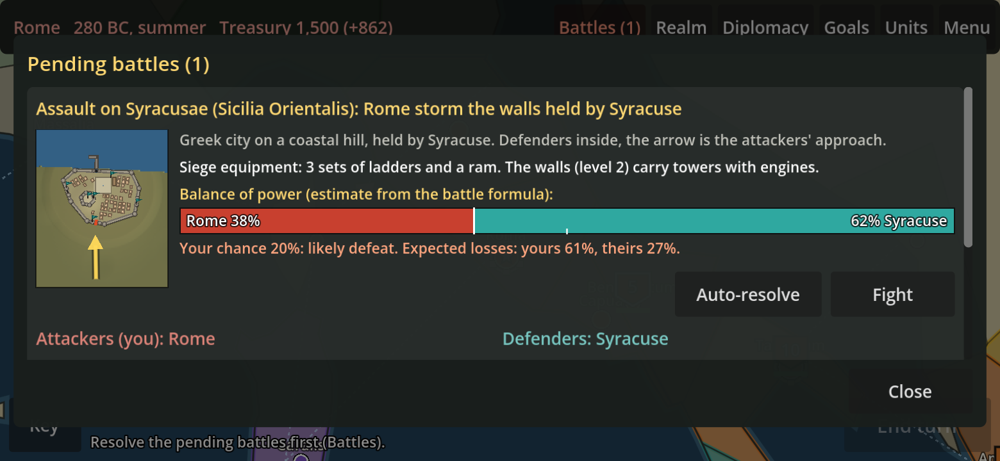

# Strategic Command

A two-player co-op grand strategy game in the spirit of *Rome II: Total War*,
built for phones and browsers. Run an empire in the western Mediterranean of
280 BC on your own time, then meet up for the battles.

## What it is

- **A campaign you play in 15-minute sittings.** Each of you commands a
  faction; turns are asynchronous, so you move your armies, build and
  recruit whenever you like and the turn resolves when you've both
  submitted. Pick any two factions: Rome, Carthage, Syracuse, Epirus,
  Macedon, the Greeks, the Iberians, the Gauls.
- **Real battles, not dice rolls.** Every soldier is simulated: health,
  shield, blocks, hits, fatigue and nerve. Pikes hold, cavalry charges
  wrap round a flank, archers lead their targets, bolt and stone throwers
  need a line of fire, and units break and run when they have had enough.
  Four thousand men on a phone at 60 fps.
- **Fight together, live.** When a battle has both your armies in it you
  can jump in at the same time: each commands their own units, you can
  gift units to each other mid-fight, and pause and speed are by vote.
  Or auto-resolve and get on with the turn.
- **Cities worth taking.** Settlements grow from villages to walled cities
  in the style of their founders: Roman grids, Greek towns with an
  acropolis, Punic citadels, Celtic hill forts. Break a gate with
  artillery or axes, hold the walls with your archers, take the plaza.
  Or besiege and starve them out.

| | |
|---|---|
|  |  |
| A field battle in Gaul: woods slow cavalry and swallow arrows | Through the gate: the fight in the streets |
|  |  |
| A Greek city on a coastal hill with its acropolis | Besieging Tarentum: the odds before you storm |

## Co-op play

1. One of you creates a campaign and sends the other a join code.
2. Each turn: move armies across the map (paths, zones of control, sieges
   by marching onto a city), build, recruit, trade, make and break
   treaties. Armies within range support each other in battle. Submit.
3. When a battle involves one of you, you get a ping. Fight it yourself,
   auto-resolve it, or open the lobby and fight it together in real time;
   the other player can join any fought battle and be given units.
4. Gift units or whole armies to each other on the map, and pass units
   across during a live battle.

## Tech, briefly

Godot 4 (GDScript), exported to the web as a progressive web app; a
deterministic integer-only battle simulation with lockstep networking for
live co-op; a small Go server with SQLite for campaigns, turns and battle
coordination. Design notes live in [`docs/`](docs/).

Playable in any modern browser on Android, iPhone or desktop. Ask Garrett
for the link and the invite key.
